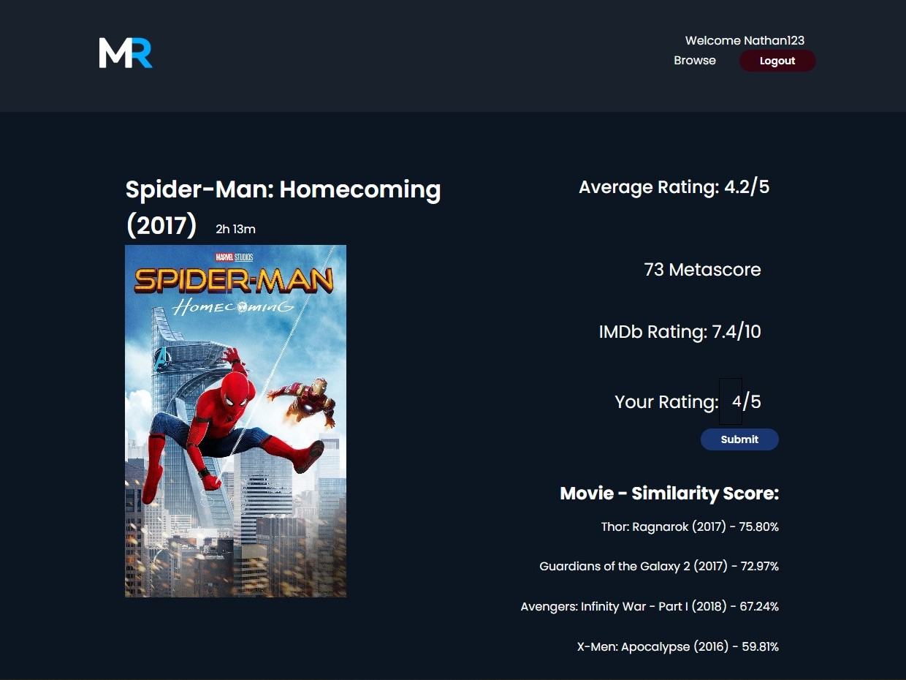

# Movie Recommendation System

## Introduction 

MR is a movie recommendation system web application where users can create accounts, rate movies they watched and get recommendations based on the movies they liked or based on users who are similar to their tastes. When selecting a movie from the list, users are able to see its initial details like average ratings, Metascore, IMDb ratings, and similar movies recommended based on users ratings from dataset. Upon submitting a new rating, the similar score will change accordingly.

## Description

- Dataset used: **MovieLens**. 
*(Data were extracted for movies and user ratings, with mostly Marvel movies)*

- Algorithm used: **item-based collaborative filtering**. 
*(We chose this approach because people’s opinions/tastes are likely to change over time whereas movies don't, hence the consistency)*

## Team member

- Yiran Zhu
- Nam Long Pham
- Arnesh Jairath

## Setting up

1. Requires [Python](https://www.python.org/downloads/) and [Node.js](https://nodejs.org/en/download/)
2. Navigate to the repo's directory and install required packages:

- Python:
```
pip install -r requirements.txt
```
- Node packages:

```
npm install
```
Alternatively:
```
npm install express
npm install cookie-parser
npm install compression
```
3. Launch the app:
```
node index.js
```
4. Access the app via localhost: http://127.0.0.1:8888/
